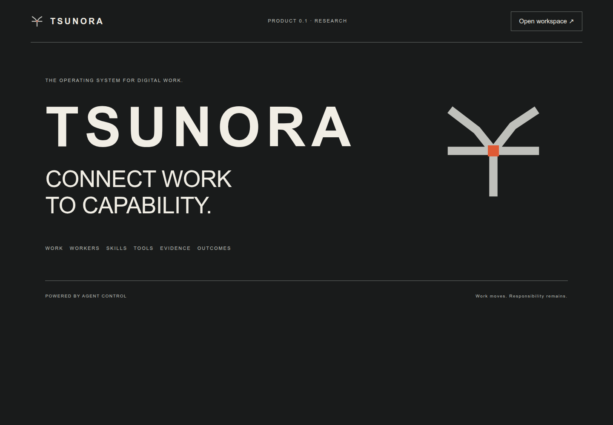

# Tsunora

**Connect work to capability.**

Tsunora is a governed operating environment for digital work, derived from Agent Control. It connects scoped work to qualified digital workers, governs execution, verifies bounded outcomes, and retains evidence, provenance and internal accounting.

**Current product status:** `0.1.0-dev`  
**Agent Control runtime lineage:** `4.15.0`  
**Published source line:** `main`  
**Original workforce qualification anchor:** `3e0e6cb183c4a6941c9fdf24aee1ef7870996ee8`  
**Clean-install qualification candidate:** `c810d643a9c9d16acc2e54f5c30051d02e9762cc`  
**Status:** **EXPERIMENTAL — PASS WITH DOCUMENTED LIMITATIONS**

The Digital Labour Exchange and Workforce Operations prototype are research software, not a production HR/payroll platform. Workers used in the current physical demonstration are deterministic; real enterprise integrations, production authentication and model-backed workforce execution remain separately unqualified.

## Why “Tsunora”?

**Tsunora is a coined brand name**, inspired by the Japanese word *tsunagu* (繋ぐ), meaning “to connect” or “to link”. Tsunora itself is not presented as a Japanese word.

The name also carries forward the idea behind **KNect Solutions**: connecting people, process, technology and solutions. Tsunora extends that principle to:

**work · workers · skills · tools · evidence · outcomes**

The product idea is simple: turn fragmented capability into governed, verifiable work.

> **Work moves. Responsibility remains.**

## What is published?

`main` now combines the privacy-reviewed Tsunora baseline, the Digital Labour Exchange, the Workforce Operations research prototype, and the qualified clean-install/restart repairs.

### Digital Labour Exchange

The exchange provides governed allocation between work and digital workers. Its current design includes stable worker identity independent of model/backend, contract-bound verification, budget and admission controls, organisation-scoped accounting, single-writer ownership, backend revision/qualification, retained bids/awards/attempts, and resource/transaction accounting.

The architecture was deliberately evaluated for generic techniques that strengthen ownership, identity, completion, accounting and recovery. Useful techniques were implemented without adding provider-specific coupling, mandatory hierarchy metaphors, hard financial claims or unsupported distributed-control assumptions.

See:
- [Digital Labour Exchange design](docs/DIGITAL-LABOUR-EXCHANGE-v4.15-DESIGN.md)
- [Digital Labour Exchange qualification](docs/DIGITAL-LABOUR-EXCHANGE-v4.15-QUALIFICATION.md)
- [Economic qualification](docs/DIGITAL-LABOUR-EXCHANGE-v4.15-ECONOMIC-QUALIFICATION.md)

### Workforce Operations prototype

The current research prototype physically demonstrated three governed workforce scenarios:
- autonomous low-risk completion;
- high-risk approval pause and resume;
- wrong-target scope block, owned-process containment, quarantine and recovery.

The frozen R&D workload executed 360 cases across three configurations. Boundary outcomes were 120/120, 100/120 and 120/120. The 20 retained failures were cases where recovery correctly found no eligible replacement worker.

The original workforce qualification anchor passed **2,480/2,480** tests. The later clean-install qualification passed **2,482 tests, zero failed, one skipped**; the skip is the Bubblewrap/systemd-user sandbox test whose environment was unavailable.

## Branch and provenance model

- `main` is the public source line and includes the merged Workforce Operations and clean-install qualification work.
- `research/workforce-ops` remains the research lineage used to develop and qualify the workforce changes.
- The workforce qualification anchor `3e0e6cb…` is a direct child of the reviewed public base.
- Documentation-only commits after the qualification anchor do not expand the qualification claim.
- Private evidence and local-environment artefacts are intentionally excluded from public Git.

## Run

Start with the [Tsunora clean-install guide](docs/TSUNORA-CLEAN-INSTALL.md). For normal public installation use `main`; the guide also records the exact qualification lineage, Git and source-archive routes, and the separation between the core dashboard and Workforce Lab research launcher. Historical Agent Control guides are provenance, not current Tsunora installation instructions.

Exchange use requires explicit `AGENT_CONTROL_LABOUR_EXCHANGE=1` configuration and trusted host registration of organisations, backends, workers and verifiers as documented in the [operations guide](docs/DIGITAL-LABOUR-EXCHANGE-v4.15-OPERATIONS.md). Without that configuration, the workspace fails closed.

## Historical platform references

The [inherited first-run walkthrough](docs/installation-first-run.md) and [Android prerequisites](android/README.md#fresh-termux-prerequisites) remain available for provenance. Their older repository/release commands are not the current Tsunora installation route. Android and other platforms have not received fresh Tsunora clean-install qualification. Use the current guide above.

## Read

- [What is Tsunora?](docs/WHAT-IS-TSUNORA.md)
- [Architecture](docs/ARCHITECTURE.md)
- [Digital workforce](docs/DIGITAL-WORKFORCE.md)
- [Workforce prototype design](WORKFORCE-PROTOTYPE-DESIGN.md)
- [Workforce prototype qualification](WORKFORCE-PROTOTYPE-QUALIFICATION.md)
- [Workforce prototype R&D results](WORKFORCE-PROTOTYPE-RD-RESULTS.md)
- [Workforce prototype threat model](WORKFORCE-PROTOTYPE-THREAT-MODEL.md)
- [Publication provenance](docs/provenance/PUBLICATION-LINEAGE.md)
- [Agent Control lineage](docs/provenance/AGENT-CONTROL-LINEAGE.md)
- [Current release status and limitations](docs/RELEASE-STATUS.md)

## Licence

Copyright 2026 Lawrence Knowles.

Tsunora original code, including inherited original Agent Control runtime code, is licensed under the [Apache License, Version 2.0](LICENSE). Third-party components retain their own licences and attribution requirements; see [THIRD-PARTY-NOTICES.md](THIRD-PARTY-NOTICES.md).

**Powered by Agent Control.**
