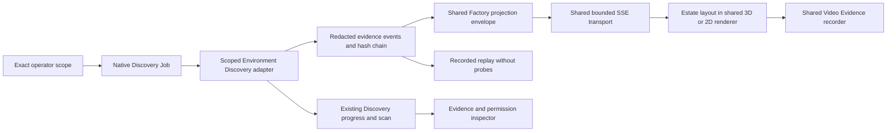

# Estate discovery and Factory integration

Estate View constructs a read-only map from the evidence of a native `discover-estate@1.0.0` Job. The first frame is empty. Discovery does not register resources, promote models, change routes or grant execution authority.

## Existing architecture and gaps

The base already contains Environment Discovery adapter progress, native Job workers/actions/artifacts, operator authentication and same-origin mutation checks, an optional Factory SSE observer, bounded frame history, a Three.js renderer with a 2D fallback, and one shared Video Evidence recorder. Diagnostics already enforces separately selected log sources and produces sanitised, historical assessments.

The gaps were per-resource evidence transitions, explicit relationship authority, a governed Discovery Job, durable event replay, exact scope categories, an Estate spatial layout and real Estate-to-Factory resource continuity. This change adds those features using the existing components. It introduces no scheduler, provider router, model admission path or second renderer/recorder.

`EnvironmentDiscoveryRuntime.discoverScoped` runs only supplied trusted adapters with an empty configuration context. It shares the existing progress, scan reconciliation and inventory persistence. Scoped scans require their originating permission for normal inventory and direct scan access, including after restart; missing authorizers fail closed. Ordinary existing Discovery behaviour is retained.

## Shared data path

The native Job owns process helpers, abort signals and execution checks. The browser never runs probes. Renderer failure or disconnect cannot cancel Discovery. `estateEnabled:false` or `AGENT_CONTROL_ESTATE_VIEW=off` disables the display endpoints without removing the native Job. Factory and Estate use `agent-control.factory-frame/v1`; optional `domain: ESTATE` and `estate` metadata distinguish spatial semantics. The schema extension is in `factory-event.schema.json`.

## Scope and evidence

Ten categories are explicit: passive inventory, configuration read, process inspection, service enumeration, network relationship discovery, log inspection, capability probes, remote host discovery, repository inspection and storage inspection. Grants bind an actor, exact allowlisted target IDs and category set, expire after one hour, and may be revoked during a probe. Unknown targets, additional input fields, arbitrary commands and arbitrary URLs fail closed.

This candidate implements bounded controller-local OS/CPU/GPU metadata, worker registry observations, running systemd unit names, selected numeric-loopback model APIs, selected repository revision and selected filesystem capacity. Repository and storage targets are administrator supplied, never free-form browser paths. No process arguments, environment variables, credential files, repository content/history or model weight contents are read. Helper output is capped at 64 KiB with an eight-second abort; endpoint responses at 128 KiB, twenty seconds, and no redirects. A Discovery execution has a 120-second deadline. Text probes request at most sixteen output tokens from a selected local endpoint. Remote hosts, process inspection and physical network discovery have no adapter in this candidate: missing scope is BLOCKED; selected unsupported categories are UNKNOWN. No LAN scan occurs.

States are EXPECTED, OBSERVED, IDENTIFIED, VERIFIED, CAPABILITY_VERIFIED, UNREACHABLE, STALE, CONFLICTED, BLOCKED, UNKNOWN and HISTORICALLY_OBSERVED. Each means the evidence for that entity, not a global readiness score. Verification requires a current successful named probe. Capability verification additionally requires the capability category and a capability probe receipt. Local host verification compares Node OS identity with an independent kernel command. Model identity is provider-reported, not a weight digest. A literal text response pass establishes only `literal-text-response/v1`; it establishes neither tool calling nor production qualification. Current observations become STALE after restart or five minutes without a fresh scan. Replay preserves original timestamps and states.

Each entity/edge has first and last seen times and individual evidence references containing source, method, type, probe, result, permission/category, timestamp, native run/ledger reference and a digest of sanitised facts. Raw probe bodies are not retained. Identity disagreement becomes CONFLICTED within a scan. A verified endpoint does not verify its links. Physical mode means evidenced host hardware or local metadata containment, never invented cable layout. Logical mode distinguishes reported, configured, inferred and verified connections.

Log integration accepts selected existing Diagnostics assessment IDs only when both the Estate log category and the original Diagnostics source permission remain valid. Only components supported by timestamped log events are mapped; configuration-only components are not converted to history. Cross-component historical correlations are labelled as historical correlations, never current dependencies or causal proof. Historical entities have distinct IDs and cannot satisfy the native consumer's current verification gate. Revoked or expired Diagnostics permission also withholds dependent Estate snapshots and replay. No real production log sources were authorised by this task.

## Persistence, replay, bounds and scale

Each native run appends `agent-control.estate-event/v1` events, with sequence, source run, timestamp, source-derived caption, optional updated entity/relationship, previous hash and SHA-256. The latest twenty snapshots and grants are indexed in an atomically replaced state file; per-run event journals and the scope audit remain append-only files. Event chains are checked on reload/export. These are local digests, not externally signed attestations. Filesystem access remains the administrator's trust boundary.

A run is bounded to 10,000 entities, 50,000 events and 32 MiB of event data. Live replacement frames contain at most 600 entities and 1,000 relationships; search covers the full authorised snapshot and returns another bounded page. The renderer separately limits visible objects to 160, or 80 in low-detail mode, with service collapse, host/kind filters and search focus. Omissions are displayed. Recorded replay is event-driven, not a second discovery run. LIVE, PAUSED and REPLAY labels persist in the view; PAUSE only freezes the display. Durable replay recovers evidence missed by coalesced live frames or disconnects. Slow SSE readers are disconnected instead of accumulating unbounded writes.

Snapshots compare only equal scope digests. Differences include new/changed models, services/configuration, unreachable, recovered and capability added/lost. Absence is NOT_REOBSERVED; it is not removal. Previously observed resources absent from a comparable completed rescan remain visible as STALE, with the original last-seen time and capability status UNKNOWN. First-seen times survive comparable rescans. REMOVED/MODEL_REMOVED require an explicit authoritative removal event; current local adapters produce no removal claims. Unknown or unprobed capability status is not a regression. Recorded replay never reissues API requests to the estate.

## Native continuity and video

The controller observer appears as `worker:agent-control:estate-observer` in Estate and Factory. `estate-system-observation@1.0.0` checks the selected snapshot's active permission, current host identity and successful local observation probe, then uses the existing admitted controller worker to capture current CPU/memory metadata. A separate native verification step validates the stored artifact and preserves its checksum. Discovery itself does not admit a new worker or model; worker registration belongs to trusted application bootstrap. Unconfigured discovered models have no manufactured Factory identity.

Video Evidence Mode starts before a discovery submitted from Estate and on an observed active discovery. It uses `video-evidence.js`, adds authoritative event captions and selected evidence, and can follow the transition into Factory. Native capture stops at the shared recorder limits of ninety seconds or approximately 32 MiB. Real discovery may finish faster than a video frame: the durable event replay preserves those intermediate states without slowing or staging probes. The full live recording and replay export are separate evidence, clearly labelled.

## Qualification and limits

`npm run check` includes permission, history/current separation, redaction, abort, restart, relationship, diff, reconnect, native interoperation, observer failure and display-scale tests. Scale fixtures are explicitly synthetic and do not qualify a physical estate. `scripts/qualify-estate-view.ts` runs the real local browser/native Job sequence, captures actual screenshots/video, exports event provenance and verifies a genuine resource-consuming Job. `scripts/qualify-estate-performance.ts` compares matched local scopes with and without a connected observer.

This implementation is a local-discovery candidate. Multi-host remote discovery, device/container-specific identity adapters, physical network topology, process metadata, signed external anchors and production model qualification remain unimplemented/unproven. Hardware inventory does not establish GPU ownership by a model, so no such edge is drawn. Production logs remain uninspected. No deployment, service restart, route change, merge, tag or publication is part of this candidate.
