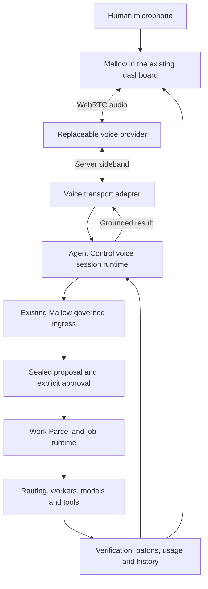

# Agent Control 4.7 — Mallow voice

The 4.7 live transport is experimental pending provider and physical-device qualification. Voice is an optional interface to the existing governed runtime. Text, jobs, Crew, Process Map and readable job history remain available without a voice provider.

## Use Mallow

Open the floating Mallow companion. Type a request or select **Talk to Mallow**. With a configured live adapter this starts a continuous conversation. With the existing private speech service, tap once to record and again to send; **Hold to speak** remains available. An unavailable microphone or provider leaves the text box available.

A request to start a registered job creates a proposal. **Review pending job** opens its exact inputs, effects and worker readiness. **Approve this job** submits the sealed proposal through the existing Work Parcel controls. Spoken assent is not substituted for that approval. The current conversational job registry supports approved defaults; custom inputs retain their normal job form. Unregistered actions are not executable through speech.

Select a linked Work Parcel to inspect its work. Use the normal Process Map and session controls to inspect actual execution where the selected runtime supplies a session. Deterministic jobs do not manufacture a terminal or an LLM invocation. Use **Transcript** for the conversation, **Voice history** for live-session records and the job's readable history for its execution, inputs, outputs, model usage and evidence.

## Transport architecture



`VoiceTransport` handles audio negotiation, provider events and speech updates. `VoiceTransportRuntime` owns authenticated conversation binding, transcript history, request deduplication, lifecycle bounds and the ingress port. Existing Agent Control components own approval, worker selection, policy, context, batons and execution. The adapter cannot run a tool or approve a job. Another provider can implement the same port without changing these controls.

## Configure GPT-Live

Use an existing authorised server environment reference:

```sh
AGENT_CONTROL_VOICE_TRANSPORT=gpt-live
AGENT_CONTROL_VOICE_CREDENTIAL_ENV=OPENAI_API_KEY
```

The referenced credential must already be available to the Agent Control server. Never put it in dashboard JavaScript, a URL, a committed configuration or an evidence file. Session creation requires dashboard mutation authority and an allowed origin. Removing the transport selection disables new live sessions; restart the selected controller after changing its environment.

The adapter uses exact model `gpt-live-1`, `POST /v1/live/sessions`, WebRTC and a server-authenticated sideband. Client delegation keeps backend execution within Agent Control. Provider session storage is disabled. These contracts were checked against the official [WebRTC guide](https://developers.openai.com/api/docs/guides/voice-webrtc?api=live), [client delegation guide](https://developers.openai.com/api/docs/guides/live-delegation?delegation-mode=client) and [server controls](https://developers.openai.com/api/docs/guides/voice-server-controls?api=live) on 14 September 2026. Protocol tests are not evidence of account access or played audio.

For existing private STT/TTS, set `AGENT_CONTROL_MALLOW_VOICE_CONFIG` to the existing authorised configuration. The historical environment alias remains compatible. `config/mallow-voice.json` illustrates an original voice design; the selected private speech service must explicitly support the actual configured voice identity. Changing this example does not reconfigure a device or running voice service.

## Mobile behaviour

Use HTTPS or a phone-local localhost route and allow microphone access. On denial, enable the microphone in browser site settings and retry, or use text. Live speech can be interrupted by speaking; **Stop speaking** additionally mutes local playback immediately. **Resume speaker** re-enables it. **Mute microphone** does not end the billed session. **End voice** closes the session and collects final usage where available.

The current policy ends voice when the page becomes hidden or connectivity is lost. Reconnect explicitly in the same conversation; existing jobs continue and history is restored. It does not promise seamless Wi-Fi/mobile-data handoff, locked-screen listening, background audio, Bluetooth routing or recovery from OS process termination. Those require physical qualification on the chosen browser and device. Do not describe viewport emulation as handset evidence.

Sessions have a five-minute application limit, a twenty-second client lease, bounded transcript/delegation queues and no automatic paid retry. On controller restart, interrupted records remain inspectable and are not silently replayed.

## Usage, cost and privacy

Live duration is the latest provider-reported cumulative value; repeated snapshots are not summed. Finalization requires the provider's final event. An interrupted connection leaves final usage unconfirmed. The adapter's dated rate is $0.05/minute, billed per second; the displayed amount is a calculation, not an invoice. Initialization can incur fifteen seconds even if setup fails, so an unknown duration must not be displayed as zero. See the [model pricing](https://developers.openai.com/api/docs/models/gpt-live-1) and [usage guidance](https://developers.openai.com/api/docs/guides/voice-latency-cost?api=live).

Worker input, cached input, fresh input, output and total tokens remain in job Usage and readable history. Cached input is a subset of input. Voice duration and cost are separate from worker/model cost. The UI does not invent cache savings or a combined total when model cost or session-to-job cost allocation is unknown. A conversation may contain several jobs; charging its whole duration to every job would double-count it. Existing local speech reports audio duration and latency; its monetary cost remains unknown.

Voice transcripts are untrusted data. Only provider-side transcript/delegation events enter live ingress; the browser has no API to submit authoritative provider events. The adapter ignores reflected audio and protected internal context. Agent Control retains redacted text, timestamps, transcript fragments, delegation outcomes, conversation references, reported duration and calculated cost in owner-only local voice records. Raw audio and SDP are not retained by this runtime. Local speech playback may be held in browser memory and is released when stopped. Provider-side retention remains governed by the selected provider/account policy.

Records persist across restart and remain subject to the estate's existing backup and retention policy; this candidate does not automatically delete historical audit evidence. A transcript or commentary acknowledgement does not establish that speech was heard. Generated audio validation and physical playback are separate checks.

## Troubleshooting

| Symptom | Interpretation / action |
| --- | --- |
| Configuration required | No selected adapter or no credential at its configured reference; use existing speech or text. |
| Authentication / access denied | Provider rejected the existing credential or model access; inspect the authorised configuration. |
| Quota exhausted | Provider reported a quota failure; do not infer it from an authentication label. |
| Rate limited | Provider throttled the request; there is no automatic spend-bearing retry. |
| Transport / sideband disconnected | Voice connection failed; inspect final-usage status and reconnect explicitly. |
| Controller restarted | Retained session is interrupted; jobs and their runtime recovery remain separate. |
| Waiting for approval | Open Review pending job and review the sealed request. |
| Worker or baton failed | Inspect the linked job evidence; a healthy voice session does not imply healthy execution. |
| Slow recorded speech | Inspect reported recognition/synthesis latency and the selected local runtime; this is not live streaming. |

Mallow is the current original public persona. Existing audit IDs, compatibility paths and historical packets retain their original identity. Current wording and the active SVG companion use Mallow; no historical evidence is rewritten to conceal its origins.
