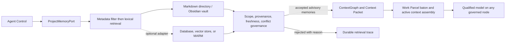

# Agent Control 4.5 project-memory portability experiment

Status: experimental. Normal user-facing UX calls this capability **Your Memories**. `ProjectMemoryPort` and backend names are technical terms used only in architecture, diagnostics, and evidence.

The 2026-09-11 [physical cross-model qualification](provenance/EXTERNAL-EVIDENCE.md) initially passed five of twelve requested writer→cold-reader cells. The [completion qualification](provenance/EXTERNAL-EVIDENCE.md) subsequently classified nine as PASS/FIXED, two Qwen→Pixel aliases as UNSUPPORTED, and OpenRouter GLM→Qwen as BLOCKED_EXTERNAL. The [final closure audit](provenance/EXTERNAL-EVIDENCE.md) preserves every row and records the later result: 11/12 exact routes PASS/FIXED after the Pixel reader passed the unchanged semantic verifier; OpenRouter GLM→Qwen remains BLOCKED_EXTERNAL, with the same model pair separately proven through NVIDIA. Evidence also includes both controller directions, repeated Pixel Gemma 4 E4B writer trials, a real POE-initiated transition between isolated MSI Codex profiles, and a production POE safe escalation from unsupported Qwen→Pixel to qualified Qwen→Luna. Strong-model consolidation improves the measured Qwen/Sol average by 4.54 points. No provider-native ChatGPT personal memory was inferred.

## Route qualification

Set `AGENT_CONTROL_MEMORY_ROUTE_QUALIFICATIONS` to an owner-only qualification file and `AGENT_CONTROL_MEMORY_ENFORCE_ROUTE_QUALIFICATION=1` to enforce current records. A record identifies the route by provider, optional account profile, model and node, then binds runtime version, `agent-control.project-memory-exchange/v1`, role-specific eligibility, the largest physically proven payload, freshness and evidence. Exact writer→reader pair records are required. Missing, stale, oversized, unsupported or contract-mismatched routes fail closed. An alternate is selected only when the record names a qualified escalation pair; Agent Control records the requested route, selected route and reasons in the Work Parcel evidence.

Agent Control treats durable memory as advisory context. A memory cannot alter a Work Parcel, approve work, grant authority, replace a baton, or satisfy verification. Current repository and physical evidence outrank remembered claims. Assistant memory is an untrusted source and follows the same checks.



The first backend stores a JSON metadata envelope in a human-readable Markdown note. Obsidian can display the directory, but core uses no Obsidian API. Every record binds project and optional repository/session scope, originating node and route, source, confidence, verification timestamps, expiry/revalidation, provenance IDs and hashes, supersession links, and a content hash.

Retrieval filters scope, rejects invalid/unverified/expired/superseded records, detects contradictory current records sharing a fact key, then ranks lexically under item and byte limits. Conflicting values are all rejected; rank never decides factual authority. Semantic retrieval remains an optional future adapter.

## Cross-node storage rule

Each node writes to a node-local staging namespace using an exclusive writer lock, owner-only temporary file, and atomic rename. Cross-node synchronization must copy immutable content-addressed notes and record source/destination hashes before promotion. Nodes must not concurrently edit one canonical note. A name collision with unequal content is a conflict, never last-writer-wins.

The discovered vaults are independent:

- controller node: an operator-configured local vault (small local Git repository, no remote);
- remote desktop experiment vault: an operator-configured node-local Obsidian vault (no Git repository at discovery time);
- any separate cloud-synchronised vault is out of scope and remains untouched.

The isolated namespace is `Agent Control/4.5-memory-portability`. No existing notes are overwritten.

## Promotion lifecycle

```text
working context -> baton/session summary -> candidate memory
  -> provenance and independent validation -> durable verified memory
  -> bounded retrieval -> revalidation, supersession, invalidation, or forget
```

Model output may propose a candidate. Agent Control binds evidence and controls promotion. Routine observations and transient conversation remain ephemeral.

## Qualification boundary

Deterministic tests prove atomic writes, integrity checks, bounded retrieval, scope isolation, expiry rejection, candidate rejection, contradiction detection, and explicit supersession. Physical writer/reader cells are reported only when the exact provider, model, endpoint/version, and node execute through a real governed route. An unavailable route remains `NOT EXERCISED`; no substitute model is implied.
