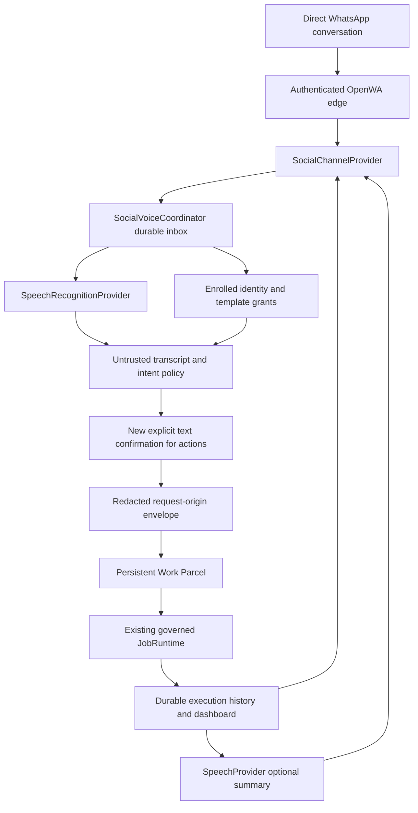

# Social & Voice capability extension

This isolated extension builds on the qualified 3.9 Work Parcel/runtime and the OpenWA pilot. It is not a release or production deployment. Physical voice-input qualification is still in progress; consult qualification.md for observed results and limitations.

## Architecture



Generic contracts are in `src/control/social-voice-providers.ts`. The coordinator knows neither OpenWA protocol nor OmniVoice packages. `OpenWASocialProvider` normalizes authenticated direct messages, downloads bounded media from one fixed private gateway and uses the existing durable outbox. `PrivateSpeechProvider` is an optional authenticated loopback HTTP edge for synthesis and recognition. `scripts/speech-worker.py` loads the pinned speech implementation in its own Python environment and process.

## Governed commands

Existing `help`, `jobs`, `run <template>`, `status job 1`, `cancel job 1` and reports remain available. Social & Voice adds `start <approved-template> [voice]`, `job AC-1`, `stop AC-1`, `voice AC-1`, `status`, `health`, `models`, `nodes`, and "What's Agent Control doing?". When POE is configured, an enrolled direct sender may also send `POE: <question>` or `ASK POE: <question>`. That read-only conversation reaches the same POE evidence/persona runtime through a separate identity-hashed WhatsApp conversation; raw account/sender identity does not enter POE state. AC references belong to the enrolled identity; they are distinct from earlier messaging job numbers. No shell command or unbounded natural-language planner is exposed. Pause/resume are explicitly unsupported. Saved repository review and benchmarking are not exposed by the AC command grammar.

Only direct, enrolled senders with a hash-pinned template grant may start work. Durable message keys deduplicate delivery. A stable Social Work Parcel ID and runtime request key bridge controller restart without creating a second run. Runtime cancellation and process cleanup remain authoritative; a stop acknowledgement does not prove cleanup.

Voice status and explicit `POE:` questions use a narrow read-only grammar. A POE voice question may explain evidence but cannot create or approve work. Every other transcript is treated as ambiguous or consequential and executes nothing. A recognized approved template produces a five-minute confirmation proposal. The operator must send a new explicit text command, which independently revalidates the template grant and records its link to the voice request. Audio does not convey authority, confidence is unavailable, and the system never guesses an action from an approximate transcription.

When execution is confirmed, the original retained transcription—not a generated summary—enters the canonical Work Parcel as `origin.request`. The envelope also carries the OpenWA channel, receipt time, enrolled-direct-sender classification, granted template, governed actor and one-way source/confirmation/identity references. The Run transcript starts with this material and explicitly states that speech recognition was untrusted and authority came from the separate text confirmation. Raw sender/account identifiers and audio bytes do not enter Work Parcel, Run, SSE or transcript records.

## Setup

Retain the OpenWA authenticated setup and separate operator enrolment described in `../openwa/README.md`. Gateway identity is verified from the linked account; its name, number and username confer no operator authority. Keep the gateway, controller, speech endpoint and session files private. Do not record QR codes, pairing material, bearer tokens or session directories.

Set `AGENT_CONTROL_SOCIAL_VOICE_CONFIG` to a private JSON file:

```json
{
  "speechUrl": "http://127.0.0.1:19194",
  "tokenEnv": "AGENT_CONTROL_SPEECH_TOKEN",
  "voice": {
    "id": "agent-control-designed-v1",
    "kind": "designed",
    "provider": "omnivoice",
    "modelRevision": "c5fdb5ccb189668d56333f77ba2629f4cd7535f4",
    "instruction": "female, low pitch, british accent",
    "seed": 3901
  }
}
```

Supply a randomly generated bearer secret of at least 32 characters through the named environment variable on the controller and `AGENT_CONTROL_SPEECH_TOKEN` on the worker. Store private files with owner-only permissions. The worker starts with `python scripts/speech-worker.py --model /absolute/pinned/model --state /absolute/private/state --device cuda:0 --port 19194`. Set environment and service resource limits outside source. Never place live credentials in example files.

Qualified source: OmniVoice `08be0b4ccbac3e13e374e86fbfead4b4cac343e2`, model revision as above. P5000 uses isolated torch/torchaudio 2.6.0 CUDA 12.4 because Pascal needs a compatible wheel. MSI uses 2.8.0 XPU. Integrated Arc needs CPU model loading followed by explicit XPU transfer because free-device-memory queries are unsupported on this hardware. This is confined to the edge worker; protected model services and existing MSI environments remain unchanged. STT uses CPU Whisper tiny.en revision `87c7102498dcde7456f24cfd30239ca606ed9063`.

Run the reproducible suite using the same worker arguments plus `--qualify`, with a fresh output directory. It emits four fixed phrases twice, WAV hashes, timings, resource samples, and a synthetic-reference cloning experiment. The pipeline is not streaming: time to first audio equals full generation time. Process startup timings do not establish a cold operating-system disk cache. Installation and download times are separate from inference.

## Approvals and cloning governance

Messaging approval is a separate authenticated grant, disabled by default. POST `/api/social-voice/approval-grant` with sender and enabled requires dashboard authentication and origin validation. Re-enrolment clears a prior grant. POST `/api/social-voice/approval` binds sender, owned parcel, runtime run and currently waiting action. Challenges expire and require fresh APPROVE/REJECT plus their readable number. Snapshot identity, action, parcel, timestamp and transition are durable. A crash after claiming a decision is deliberately uncertain and needs dashboard reconciliation; never automatically reapply it.

Designed voice identity records provider, pinned model, design instruction and seed. A cloned identity additionally requires reference SHA-256 and recorded consent metadata. The qualified cloning reference is generated synthetic audio, not a person. Clone prompt persistence uses the upstream safe loading path. Production cloning is not enabled in the HTTP adapter and no claim of human speaker similarity has been made. Voice prompts are sensitive identity material and should remain private with their provenance and retention policy.

## History, telemetry and failure behavior

The authenticated Social & Voice page shows provider health, request outcomes, Work Parcel links and separate STT/TTS latency and real-time factor. Detailed chronological text remains in the private SQLite history and authenticated transcript endpoint. Generic activity events feed the existing event stream without conversation content or sender IDs. Authoritative runtime history retains tools, selected node/model, usage, cache and costs when the actual executor reports them. An absent metric remains unavailable, never zero. Deterministic test jobs have no model inference.

Social delivery receipts distinguish queued, submitted, delivered and uncertain. A queued speech artifact is not proof of WhatsApp delivery; consult signed gateway acknowledgements and the actual conversation. Text is retained before optional speech generation. Failed TTS falls back to text. Failed STT requests text. Messaging outages cannot stop independently scheduled Work Parcels. Pending intake is durable; interrupted outbound sends are uncertain and are not blindly repeated. Inspect uncertain delivery in authenticated setup before retrying it. The generic history records queue receipts; final delivery state remains in the OpenWA outbox.

If health is unavailable, inspect the isolated worker/service and private configuration, check device availability, then retry a bounded request. Never resolve GPU unavailability by killing protected workloads. Media permits bounded audio containers only, uses fixed decoder arguments, rejects network protocols, caps duration, and never fetches a sender-provided URL. Malformed provider audio or metrics fail closed. Speech summaries exclude parcel identifiers and URLs and retain a bounded text length.

## Adding providers

Implement the generic interface, explicit capabilities and health, bounded authenticated input/output and honest delivery semantics. Normalize channel identity without inferring authorization. Preserve message IDs and timestamps and call intake only after authenticating the transport. Keep codecs/model dependencies in a separate edge process. Add deterministic identity, replay, malformed response, unavailable provider, restart, telemetry and fallback tests, then qualify the real transport and device. A provider catalog entry or unit-test fixture is not physical qualification.

## Qualified voice-note troubleshooting

Use Ogg/Opus for WhatsApp voice notes. Numeric job references caused unintelligible generation in the pinned model/settings; the coordinator spells numbers and speaks only an outcome sentence. Audio bypasses the text outbox truncation while retaining byte limits. Never blindly retry uncertain sends. An authenticated operator may request a new terminal-job summary through POST /api/social-voice/summary with the enrolled sender, owned AC reference and fresh idempotency request key. This is an explicit recovery request, not evidence that the original send succeeded. Forwarding metadata must be explicit: boolean isForwarded or a non-negative integer native forwardsCount. Missing provenance stays denied.
